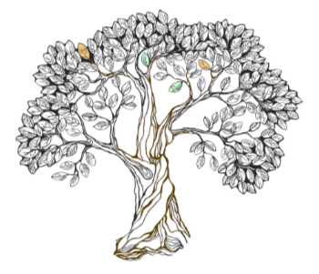

# json-utils

A Clojure/ Clojurescript library processing Json, including an implementation of json-pointer

## Usage

This library holds a collection of utility functions for working with json. It's expected to grow over time as I find additional requirements.

To include in your project, add this to your `project.clj`:

    [json-utils  "0.1.1"]
    
At present there are two key namespaces, `json-utils.pointer` for working with json pointers and `json-utils.traversal` for various ways of traversing and processing jsonic tree data structures, including a stateful version of `clojure.walk/prewalk`.

  

### Json pointer: resolving a pointer

Say you have a piece of json (here in clojure form).
This happens to be a piece of json schema, but no matter.

    json-utils.pointer> js
    {:$id "https://example.com/person.schema.json",
     :$schema "http://json-schema.org/draft-07/schema#",
     :title "Person",
     :type "object",
     :properties
     {:age
      [{:description
        "Age in years which must be equal to or greater than zero.",
        :type "integer",
        :minimum 0,
        :maximum 200}
       {:description "Age in dog years",
        :type "integer",
        :minimum 0,
        :maximum 1400}],
      :role2
      {:type "array",
       :title "role2",
       :minItems 2,
       :maxItems 10,
       :items
       {:type "object",
        :description "class B",
        :properties
        {:b1 {:type ["string"], :allOf ["Jude" "Bob"], :title "b1"}}}}}}
        
You can resolve a json pointer in string form or 'clojure form'

    json-utils.pointer> (resolve js "/properties/role2/type")
    "array"
    json-utils.pointer> (resolve js [:properties :role2 :type])
    "array"
    
External url references are paths that will be followed and can be resolved into.

If your pointer starts with an external reference url then call the `resolve` function without the json argument, for example:

    json-utils.pointer> (resolve "https:~1~1raw.githubusercontent.com~1judepayne~1clj-json-viz~1master~1example2.json#/json/properties/age/0/type")
    "\"integer\""
    
Note the use of escaping `/` characters with `~1` is json pointer. Also the use of `0` to pick up the first entry in an array. An external uri does not need to be escaped as shown above; the function will do that for you.

The results of resolving external urls is cached for 1 minute by default. The default can be overridden for all threads by calling the `ttl` function in the `uri` namespace with the new value in miliseconds (Clojure only). Doing so does not lose any cached data.

Please note that if an external url cannot be resolved, resolve will return the url rather than an error.

#### Clojurescript only

In Clojurescript, if it is not cached, the resolution of an external url will return a javascript promise rather than block and wait for the result.

You can check whether you have a promise by calling the `util\promise?` function on the result, and then if it is, attach a callback to the promise to for example put it's completed result into some state e.g. an atom. For example:

    (require [promesa.core :as p])
    
    (def A (atom nil))

    (let [result (res* "http://json-schema.org/draft-07/schema#/title")]
    (when (util/promise? result)
      (-> (p/resolved result)
          (p/then (fn [x] (reset! A x))))))
    => #<Promise[~]>

    @A
    => "Core schema meta-schema"

### Json pointer: looking up a pointer

The `lookup` function is for looking up the json path of some node within a piece of json. e.g.

    json-utils.pointer> (lookup ts ["Jude" "Bob"])
    (:properties :role2 :items :properties :b1 :allOf)
    
You can optionally supply `lookup` with a default match-fn which is applied to the node and each part of the piece of json as it is traversed. The default is `=`

Supplying `lookup` with both the json and node in string form will cause the returned path to be returned in json pointer string format, e.g. `"/properties/role2/items/properties/b1/allOf"`

Currently, `lookup` does not traverse down into external uri within the json being searched.

### Traversal: stateful prewalk

In the `json-utils.traversal` namespace, there are two functions for processing a json tree as it is traversed.

`with-path` will decorate each form in a piece of json with it's json path from the root.

For example:

    json-utils.traversal> (with-path js :expand? false :exceptions #{})
    {:$path [],
     :$id "http://json-schema.org/draft-07/schema#",
     :$schema "http://json-schema.org/draft-07/schema#",
     :title "Person",
     :type "object",
     :properties
     {:$path [:properties],
      :firstName
      {:$path [:properties :firstName],
       :type "string",
       :maxLength 10,
       :description "The person's first name."},
      :lastName
      {:$path [:properties :lastName],
       :type "string",
       :description "The person's last name."},
      :age
      [{:$path [:properties :age 0],
        :description
        "Age in years which must be equal to or greater than zero.",
        :type "integer",
        :minimum 0,
        :maximum 200}
       {:$path [:properties :age 1],
        :description "Age in dog years",
        :type "integer",
        :minimum 0,
        :maximum 1400}],
      :salary
      {:$path [:properties :salary],
       :description "Salary of a person.",
       :type "number1",
       :multipleOf 2.0},
      :role2
      {:$path [:properties :role2],
       :type "array",
       :title "role2",
       :minItems 2,
       :maxItems 10,
       :items
       {:$path [:properties :role2 :items],
        :type "object",
        :description "class B",
        :properties
        {:$path [:properties :role2 :items :properties],
         :b1
         {:$path [:properties :role2 :items :properties :b1],
          :type ["string"],
          :allOf ["Jude" "Gunjan"],
          :title "b1"}}}},
      :gender
      {:$path [:properties :gender],
       :type "array",
       :items
       {:$path [:properties :gender :items],
        :type "string",
        :enum ["male" "female" "others" "x"]}}}}
        
`with-path` has two keyword arguments:
 - `:expand-levels` is an integer which determines to how many levels down into the form external uri's should (still) be expanded. The default is 0.
 - `:exceptions` is a clojure set of keywords which are not expanded. For example, you could set `:exceptions` to be `#{:$id :$schema}`.
 
 The other traversal function is more general. `prewalk` is a statement version of `clojure.walk/prewalk` which allows state to be passed down and accumulated through the json document as it is processed and a replacement function to act on the accumulated state, the current form/node in the document and the parent node/form.
 
 Please see the docstring of `prewalk` and how it has been used to build `with-path` for further details.
 
 
##### Clojurescript only

There is a special Clojurescript only version of `with-path` called `with-path-promise` for use when you think with-path will expand external urls resulting in one of more promises. So `with-path-promise` can return either the tree directly or a promise.

Please see the Pointer Clojurescript example above for how to conditionally handle a promise as a result.
 
 
### Traversal: json-tree-seq
 
 In the same namespace there is a `json-tree-seq` function which only needs to be supplied with the Json data structure (in Clojure form). It's like Clojure's `tree-seq` but which the `branch?` and `children` function already defined.
 
 `tree-seq`/`json-tree-seq` flattens a tree and is useful for simply accumulating some state in a traversal over the flattened sequence. The `prewalk` function can be used to decorate a tree whilst keeping its structure in place. Post-processing that with `json-tree-seq` allows you to accumulate some state out of your decorated tree.

## License

MIT
